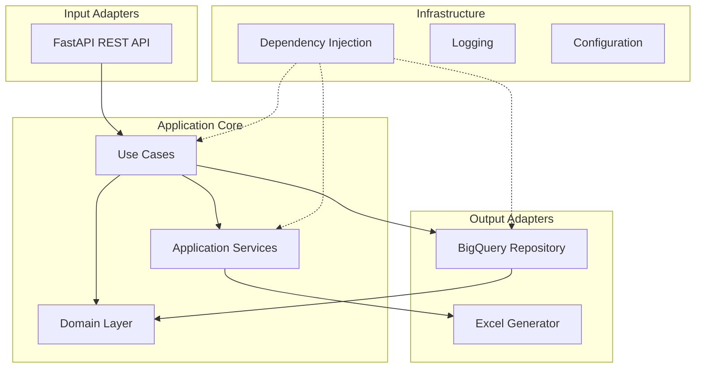

# Faco Reporting API

## 📋 Descripción

PDP Analytics API es un servicio de análisis de productividad para gestión de promesas de pago (PDP - Payment Delivery
Promise). El sistema extrae datos de BigQuery, procesa métricas de productividad por agente y genera reportes en Excel
con visualizaciones de mapas de calor.

### Características principales:

- 🔍 Extracción de datos desde BigQuery
- 📊 Análisis de productividad por agente y período
- 📈 Generación de reportes Excel con mapas de calor
- 🏗️ Arquitectura hexagonal (Clean Architecture)
- 🔌 API REST con FastAPI
- 🐳 Containerización con Docker
- 📝 Logging estructurado con Loguru

## 🏛️ Arquitectura

El proyecto sigue una arquitectura hexagonal (ports & adapters) con las siguientes capas:

### Diagrama de Arquitectura



### Estructura de Directorios

```
src/
├── adapters/               # Adaptadores de entrada/salida
│   ├── input_adapters/     # API REST endpoints
│   │   └── api/
│   │       ├── routes/     # Rutas de la API
│   │       └── dependencies/ # Inyección de dependencias FastAPI
│   └── output_adapters/    # Adaptadores de salida
│       └── persistence/    # Repositorios BigQuery
├── application/            # Capa de aplicación
│   ├── dto/               # Data Transfer Objects
│   ├── services/          # Servicios de aplicación
│   └── use_cases/         # Casos de uso
├── domain/                # Capa de dominio
│   ├── entities/          # Entidades de dominio
│   ├── repositories/      # Interfaces de repositorio
│   └── value_objects/     # Objetos de valor
├── infrastructure/        # Infraestructura
│   ├── config/           # Configuración
│   ├── database/         # Clientes de base de datos
│   ├── di/              # Contenedor de inyección de dependencias
│   ├── excel/           # Generador de Excel
│   └── logging/         # Configuración de logging
└── shared/              # Código compartido
    ├── constants.py     # Constantes
    └── exceptions.py    # Excepciones personalizadas
```

## 🚀 Endpoints API

### Health Check

#### `GET /health`

Verificación básica del estado del servicio.

**Response:**

```json
{
  "status": "healthy",
  "timestamp": "2024-06-10T10:30:00Z",
  "service": "PDP Analytics API"
}
```

#### `GET /health/detailed`

Verificación detallada incluyendo dependencias.

**Response:**

```json
{
  "status": "healthy",
  "timestamp": "2024-06-10T10:30:00Z",
  "dependencies": {
    "bigquery": "healthy",
    "postgres": "unknown"
  }
}
```

### PDP Operations

#### `POST /api/v1/pdp/process`

Procesa datos de productividad para un período específico.

**Request Body:**

```json
{
  "reference_date": "2024-06-01"
}
```

**Response:**

```json
{
  "total_records": 15420,
  "unique_agents": 125,
  "excel_file_path": "pdp_report_20240610_103045.xlsx",
  "processing_time_seconds": 5.23,
  "period": "2024-06",
  "errors": []
}
```

#### `GET /api/v1/pdp/download/{filename}`

Descarga el archivo Excel generado.

**Parameters:**

- `filename`: Nombre del archivo a descargar

**Response:** Archivo Excel (application/vnd.openxmlformats-officedocument.spreadsheetml.sheet)

#### `DELETE /api/v1/pdp/cleanup/{filename}`

Programa la eliminación de un archivo Excel.

**Parameters:**

- `filename`: Nombre del archivo a eliminar

**Response:**

```json
{
  "message": "File cleanup scheduled",
  "filename": "pdp_report_20240610_103045.xlsx"
}
```

## 🔧 Variables de Entorno

```bash
# Google Cloud Platform
GCP_PROJECT_ID=your-gcp-project-id
GOOGLE_APPLICATION_CREDENTIALS=/path/to/service-account-key.json
GCP_BIGQUERY_LOCATION=us-east1

# API Configuration
API_HOST=0.0.0.0
API_PORT=8000
API_PREFIX=/api/v1
API_TIMEOUT_SECONDS=30
API_MAX_RETRIES=3
MAX_CONCURRENT_API_CALLS=10

# Application
APP_ENV=development
APP_NAME=Telefonica PDP Analytics
DEBUG=true
LOG_LEVEL=INFO

# Excel Generation
EXCEL_OUTPUT_PATH=./output
EXCEL_TEMPLATE_PATH=./templates
```

## 📦 Instalación

### Requisitos previos

- Python 3.11+
- uv (gestor de paquetes)
- Docker y Docker Compose (opcional)
- Cuenta de servicio de Google Cloud con acceso a BigQuery

### Instalación local con uv

1. **Clonar el repositorio:**

```bash
git clone <repository-url>
cd pdp-analytics-api
```

2. **Instalar uv (si no lo tienes):**

```bash
curl -LsSf https://astral.sh/uv/install.sh | sh
```

3. **Crear entorno virtual e instalar dependencias:**

```bash
uv venv
source .venv/bin/activate  # En Windows: .venv\Scripts\activate
uv pip install -r requirements.txt
```

4. **Configurar variables de entorno:**

```bash
cp .env.example .env
# Editar .env con tus valores
```

5. **Ejecutar la aplicación:**

```bash
uv run python -m src.adapters.input_adapters.api.main
```

### Instalación con Docker

1. **Construir la imagen:**

```bash
docker build -t pdp-analytics-api .
```

2. **Ejecutar con docker-compose:**

```bash
docker-compose up
```

## 📊 Estructura de Reportes Excel

Los reportes generados contienen dos hojas:

### 1. Detalle Por Hora

Información detallada de cada agente por hora:

- Fecha y hora
- DNI y nombre del ejecutivo
- Métricas de gestión (total, efectivos, no contactos, PDP)

### 2. Mapa de Calor PDP por Hora

Visualización de productividad diaria:

- Filas: Agentes
- Columnas: Días del mes
- Valores: PDP por hora (con código de colores)
- Promedio mensual por agente

## 🔒 Seguridad

- Autenticación con service account de GCP
- Validación de inputs en todos los endpoints
- Manejo seguro de archivos (prevención de path traversal)
- Logging de errores sin exponer información sensible

## 📝 Logging

Los logs se almacenan en:

- `logs/app.log`: Logs generales (rotación cada 100MB)
- `logs/error.log`: Solo errores (rotación cada 50MB)
- Consola: Logs con formato colorizado

